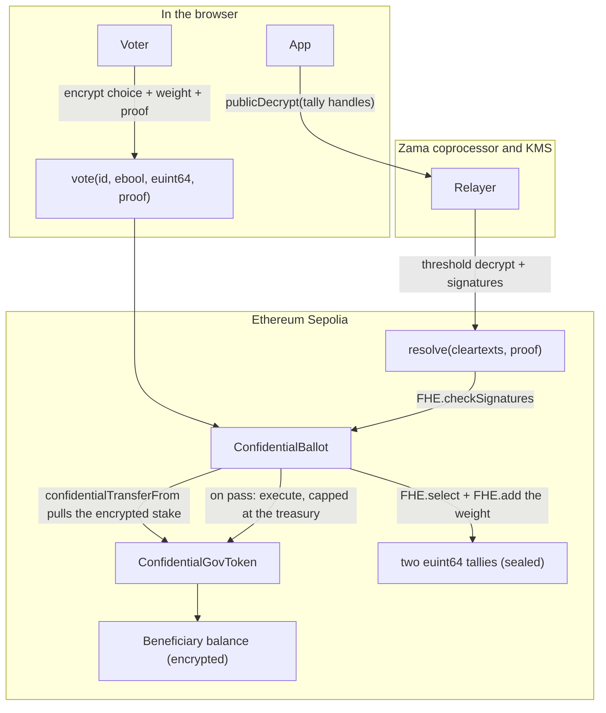

<p align="center"></p>

<h1 align="center">Conclave</h1>

<p align="center">
Confidential DAO governance on Ethereum. Every vote is encrypted in the browser,
and the contract adds the ciphertexts up with FHE without ever decrypting a
single one. Only the aggregate outcome is revealed, and a passing ballot pays
its beneficiary an amount that stays encrypted from the vote to the balance.
</p>

<p align="center">
  <a href="https://conclave-alpha.vercel.app">Live app (Sepolia)</a>
  &nbsp;&middot;&nbsp;
  Built for the Zama Developer Program Mainnet Season 3, Builder Track.
</p>

<p align="center">
  
  
  
  
  
  
</p>


## 🎯 The problem

Public on-chain voting shows who voted for what. Vote weight and direction sit
in the open, so large holders can be watched and followed, votes can be bought
with a receipt anyone can check, and voters can be pressured because their
choice is visible. Funding a proposal in public leaks a second thing: the
amount a recipient is about to receive.

The usual answers each give something up. Commit-reveal hides a vote only until
the reveal step, needs every voter to come back and reveal, and stalls when they
do not. Off-chain tools like snapshot move the tally to a server you have to
trust. None of them let the chain itself do arithmetic on votes that stay
secret. Conclave closes that gap: votes are encrypted end to end and the
contract adds them up without ever seeing them.

## 🗳 What it does

- **Stake-weighted encrypted ballots.** A voter locks an encrypted amount of
  cGOV and submits an `externalEbool` choice. The contract adds that encrypted
  weight to exactly one of two `euint64` tallies with `FHE.select` and
  `FHE.add`, so no running total, and no individual weight, is ever exposed. The
  transfer caps at the voter's balance, so nobody votes with tokens they do not
  hold.
- **One vote per address, stake returned after.** `hasVoted[ballotId][voter]`
  blocks a second vote; the choice stays encrypted, only that an address voted
  is public. Once the ballot resolves, each voter reclaims their locked stake
  with `withdraw`.
- **Aggregate-only reveal.** After the voting window, `closeBallot` makes both
  tallies publicly decryptable. The app calls the relayer `publicDecrypt`, then
  `resolve` posts the KMS-signed cleartexts back and the contract re-checks them
  with `FHE.checkSignatures`. Individual votes never decrypt.
- **Confidential treasury payout, capped.** The treasury is funded separately
  with `fundTreasury` and tracked apart from voter stakes. On a pass, `execute`
  pays the beneficiary with ERC-7984 `confidentialTransfer`, but first caps the
  amount at the treasury balance with `FHE.le` and `FHE.select`, so a ballot can
  never spend the stakes voters locked. The payout stays encrypted end to end.
- **Simulate-first actions.** Every write simulates before the wallet opens, so
  reverts such as `AlreadyVoted` or `VotingPeriodOver` arrive as readable
  messages instead of failed transactions.

## 🧭 How it works



The diagram shows the happy path. The guards carry the rest. A vote outside the
window reverts with `VotingPeriodOver`, a repeat vote with `AlreadyVoted`, and a
voter who has not authorized the ballot as a token operator with
`ERC7984UnauthorizedSpender`. `closeBallot` only runs after `endTime`. `resolve`
reverts unless the cleartexts carry the KMS signatures over exactly those two
tally handles, so a tampered count cannot land. `execute` is gated by `passed`
and an `executed` flag, and caps the payout at the separately funded treasury
with `FHE.le` and `FHE.select`, so a failed ballot pays nothing, a passing one
pays once, and neither can ever spend the stakes voters locked. After a ballot
resolves, each voter reclaims that stake with `withdraw`.

### Ballot lifecycle

| State | Entered by | Public after this step | Stays encrypted |
| --- | --- | --- | --- |
| Active | `createBallot`, `vote` | description, beneficiary, window, that an address voted | the choice, the stake weight, both tallies, the payout amount |
| Revealing | `closeBallot` | tally handles marked publicly decryptable | every individual vote |
| Resolved | `resolve` | yes and no weight totals, `passed` | the payout amount |
| Paid | `execute` | that a payout happened (`PayoutExecuted`) | the payout amount and the beneficiary balance |

Every state above, live on Sepolia with real encrypted votes (one ballot open,
one passed and paid, one rejected):


## 🔗 Live on Sepolia

The app is hosted at [conclave-alpha.vercel.app](https://conclave-alpha.vercel.app).
The contracts were deployed 2026-07-06 on Ethereum Sepolia and are verified on
Etherscan, so the exact deployed Solidity is readable under each Contract tab.

| Contract | Address | Link |
| --- | --- | --- |
| ConfidentialBallot | `0x6a66FE78bc3fF6C08Ef977D16ec16aa8EfCA7e09` | [verified code](https://sepolia.etherscan.io/address/0x6a66FE78bc3fF6C08Ef977D16ec16aa8EfCA7e09#code) |
| ConfidentialGovToken (cGOV) | `0xeb666d7F4c6Ca8AB8430A0CC63Cf6cad81b74DA1` | [verified code](https://sepolia.etherscan.io/address/0xeb666d7F4c6Ca8AB8430A0CC63Cf6cad81b74DA1#code) |

**Try it in a minute.** Open the app and click Connect: a picker lists the
injected wallets you have installed and moves the wallet to Sepolia. Then open
the Test tokens panel, which links a Sepolia ETH faucet for gas and mints 100
cGOV to your address. That is everything you need to create a ballot, vote on
the open one, and decrypt your own balance, with no external setup.

Evidence:

- Both contracts are deployed and verified on Sepolia Etherscan (Solidity
  source under the Contract tab):
  [ballot](https://sepolia.etherscan.io/address/0x6a66FE78bc3fF6C08Ef977D16ec16aa8EfCA7e09#code)
  and [token](https://sepolia.etherscan.io/address/0xeb666d7F4c6Ca8AB8430A0CC63Cf6cad81b74DA1#code).
- Ballot 2, "Fund the Q3 open-source grant round", is open for a week: connect
  a Sepolia wallet, claim cGOV, and cast a stake-weighted encrypted vote
  yourself. Ballot 0, the grants committee, resolved 50 to 10 in staked weight
  and paid its beneficiary 750 cGOV confidentially; ballot 1, the marketing
  budget, resolved 10 to 50 and paid nothing. All staged by
  [contracts/scripts/stage-demo.ts](contracts/scripts/stage-demo.ts).
- The full lifecycle is covered by 20 passing tests that run offline against the
  FHEVM mock, including one that tallies stake-weighted votes and reveals only
  the aggregate weights, and one that keeps voter stakes safe even when a payout
  would exceed the treasury:
  [contracts/test/ConfidentialBallot.ts](contracts/test/ConfidentialBallot.ts).
- Negative proof: `resolve` calls `FHE.checkSignatures(handles, cleartexts,
  decryptionProof)` before it trusts a count, so cleartexts the KMS did not sign
  over those exact handles revert. Tests also prove `execute` refuses to pay a
  failed ballot and refuses to pay twice, `mint` is owner-only, and a vote
  without operator authorization reverts:
  [contracts/test/ConfidentialBallot.ts](contracts/test/ConfidentialBallot.ts).

## 🧪 Reproduce it

Prerequisites: Node 20 or newer and Bun 1.3.x. The contract test suite needs no
network and no wallet.

```bash
git clone https://github.com/Andy00L/conclave.git
cd conclave/contracts
bun install
bun run test
```

Success is `20 passing`, run against the in-process FHEVM mock. The suite
deploys fresh contracts in memory on each run and touches no network and no
deployed instance.

Run the frontend against the Sepolia contracts above (or skip this and use the
hosted instance at [conclave-alpha.vercel.app](https://conclave-alpha.vercel.app)):

```bash
cd ../web
bun install
cp .env.example .env.local   # paste the two addresses into the NEXT_PUBLIC vars
bun run dev                  # http://localhost:3000
```

Notes: production builds use webpack (`bun run build` runs `next build
--webpack`) because the Turbopack build deadlocks on this project, documented in
[web/next.config.ts](web/next.config.ts). Deploying your own instances is
`cd contracts && bun run deploy:sepolia` after setting `MNEMONIC` with `bunx
hardhat vars set` (the RPC defaults to a public Sepolia node; override it with
`SEPOLIA_RPC_URL`). Verify a fresh deployment on Etherscan with `bun run
verify:sepolia` once `ETHERSCAN_API_KEY` is set.

## ⚠️ What is real and what is mocked

- **Voting is stake-weighted, one vote per address.** The weight is the cGOV a
  voter locks, provable because the transfer caps at their balance, and returned
  after the ballot resolves. Locking real value resists cheap sybils, but a
  whale can still outvote by staking more; a quadratic or reputation layer is
  future work.
- **cGOV mint is owner-only; the faucet is a testnet convenience.**
  `ConfidentialGovToken.mint` is restricted to the token owner (a DAO or its
  multisig in production). A public `faucetMint` hands each address a fixed 100
  cGOV once, so demo users and judges get voting weight; it would not ship on
  mainnet.
- **The reveal trusts the Zama KMS and relayer.** Aggregate decryption is a
  threshold operation run by Zama's coprocessor and key-management network. The
  contract verifies their signatures with `FHE.checkSignatures`; it does not
  replace them.
- **Final tallies are public by design.** After `resolve`, the yes and no weight
  totals are on-chain. Only the individual votes and the payout amount stay
  encrypted.

## 🧩 Prior art

- **ZamaDrop** (Zama Season 2): confidential airdrops with per-recipient amounts
  encrypted. Conclave is governance rather than distribution, and its payout is
  gated by an encrypted vote. [winners post](https://www.zama.org/post/announcing-the-developer-program-mainnet-season-2-winners)
- **Zerk** (Zama Season 2): an encrypted prediction market. Both hide a choice,
  but Zerk resolves a market while Conclave resolves a governance decision and
  executes a treasury payment. [winners post](https://www.zama.org/post/announcing-the-developer-program-mainnet-season-2-winners)
- **Snapshot and commit-reveal voting**: off-chain tallies or reveal-at-the-end
  schemes. Conclave keeps the tally on-chain and never asks voters to reveal.
  [snapshot.org](https://snapshot.org)

## 📦 Repository layout

```
conclave/
  contracts/   FHEVM Solidity (ConfidentialBallot, ConfidentialGovToken), Hardhat, tests, deploy
  web/         Next.js App Router frontend (wagmi + viem + relayer SDK, Tailwind)
  docs/        README assets, the design token sheet, submission drafts
  brand.md     brand direction and voice (tokens live in docs/UI_DESIGN_SYSTEM.md)
```

## 📜 License

The contracts are BSD-3-Clause-Clear, inherited from the FHEVM Hardhat template.
See [contracts/LICENSE](contracts/LICENSE).
