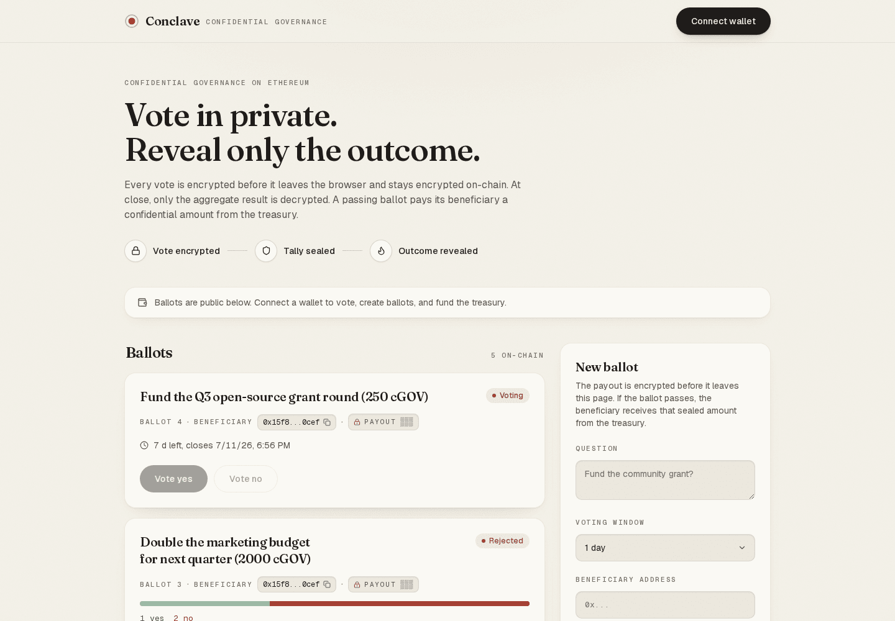
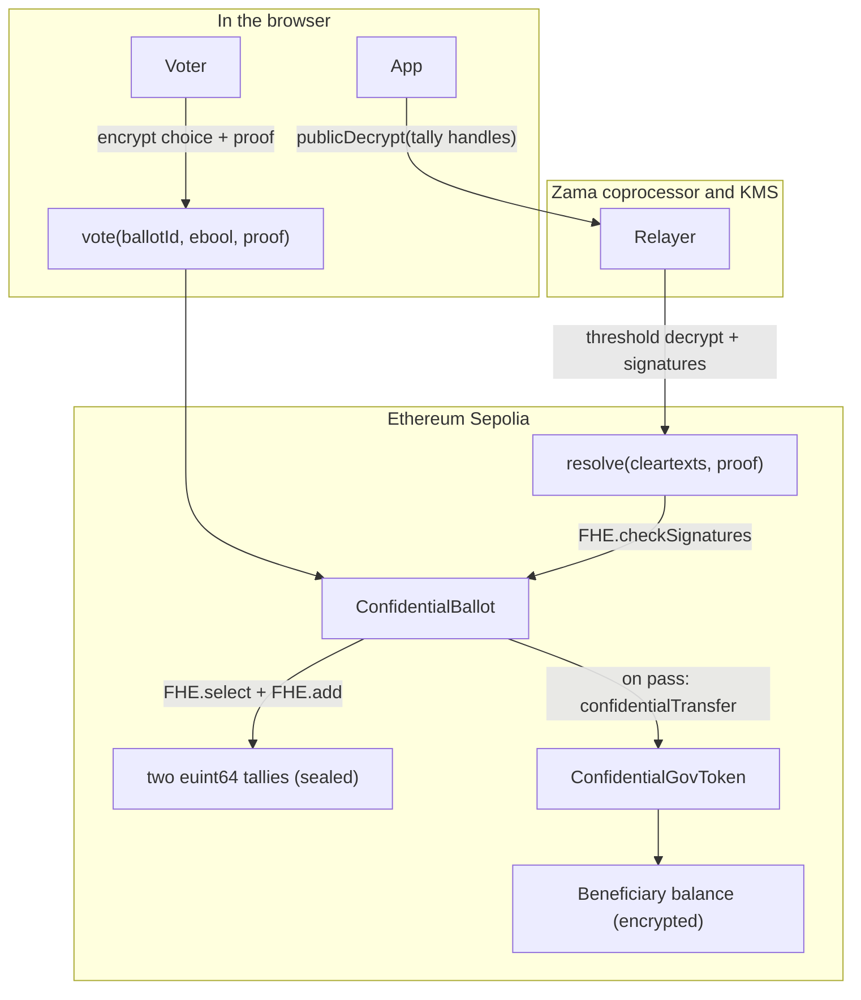
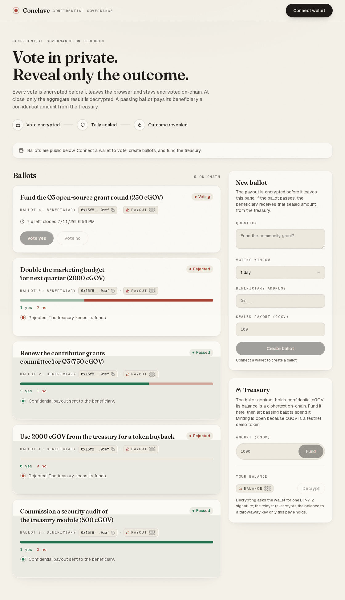

<p align="center"></p>

<h1 align="center">Conclave</h1>

<p align="center">
Confidential DAO governance on Ethereum. Each vote is encrypted in the browser
and stays encrypted on-chain; the contract tallies the ciphertexts with FHE,
reveals only the aggregate, and pays a passing ballot's beneficiary an amount
that never appears in clear.
</p>

<p align="center">
  <a href="https://conclave-alpha.vercel.app">Live app (Sepolia)</a>
  &nbsp;&middot;&nbsp;
  Built for the Zama Developer Program Mainnet Season 3, Builder Track.
</p>

<p align="center">
  
  
  
  
  
  
</p>



## 🎯 The problem

Public on-chain voting shows who voted for what. Vote weight and direction sit
in the open, so large holders can be watched and followed, votes can be bought
with a receipt anyone can check, and voters can be pressured because their
choice is visible. Funding a proposal in public leaks a second thing: the
amount a recipient is about to receive.

The usual answers each give something up. Commit-reveal hides a vote only until
the reveal step, needs every voter to come back and reveal, and stalls when they
do not. Off-chain tools like snapshot move the tally to a server you have to
trust. None of them let the chain itself do arithmetic on votes that stay
secret. Conclave closes that gap: votes are encrypted end to end and the
contract adds them up without ever seeing them.

## 🗳 What it does

- **Encrypted ballots.** A voter submits an `externalEbool` plus an input
  proof. The contract adds an encrypted `1` to exactly one of two `euint64`
  tallies with `FHE.select` and `FHE.add`, so no running count is ever exposed.
- **One address, one vote.** `hasVoted[ballotId][voter]` blocks a second vote.
  The choice stays encrypted; only the fact that an address voted is public.
- **Aggregate-only reveal.** After the voting window, `closeBallot` makes both
  tallies publicly decryptable. The app calls the relayer `publicDecrypt`, then
  `resolve` posts the KMS-signed cleartexts back and the contract re-checks them
  with `FHE.checkSignatures`. Individual votes never decrypt.
- **Confidential treasury payout.** Each ballot carries a beneficiary and an
  encrypted `euint64` payout. On a pass, `execute` moves it with ERC-7984
  `confidentialTransfer`, so the amount stays encrypted from vote to payment.
- **Simulate-first actions.** Every write simulates before the wallet opens, so
  reverts such as `AlreadyVoted` or `VotingPeriodOver` arrive as readable
  messages instead of failed transactions.

## 🧭 How it works



The diagram shows the happy path. The guards carry the rest. A vote outside the
window reverts with `VotingPeriodOver`, a repeat vote with `AlreadyVoted`, and
`closeBallot` only runs after `endTime`. `resolve` reverts unless the cleartexts
carry the KMS signatures over exactly those two tally handles, so a tampered
count cannot land. `execute` is gated by `passed` and by an `executed` flag, so
a failed ballot pays nothing and a passing one pays once. If the treasury holds
less than the payout, ERC-7984 transfers what is available rather than reverting.

### Ballot lifecycle

| State | Entered by | Public after this step | Stays encrypted |
| --- | --- | --- | --- |
| Active | `createBallot`, `vote` | description, beneficiary, window, that an address voted | the choice, both tallies, the payout amount |
| Revealing | `closeBallot` | tally handles marked publicly decryptable | every individual vote |
| Resolved | `resolve` | yes and no counts, `passed` | the payout amount |
| Paid | `execute` | that a payout happened (`PayoutExecuted`) | the payout amount and the beneficiary balance |

Every state above, live on Sepolia with real encrypted votes (one ballot open,
one passed and paid, one rejected):




## 🔗 Live on Sepolia

The app is hosted at [conclave-alpha.vercel.app](https://conclave-alpha.vercel.app);
connect a Sepolia wallet and every feature below is usable. Contracts deployed
2026-07-03 on Ethereum Sepolia.

| Contract | Address | Link |
| --- | --- | --- |
| ConfidentialBallot | `0xb9e89A9819d740C723a448BF7D3513D13b7e4F53` | [view](https://sepolia.etherscan.io/address/0xb9e89A9819d740C723a448BF7D3513D13b7e4F53) |
| ConfidentialGovToken (cGOV) | `0x62D93Eac4719F33DAab75f6B8E1aE4DDdd96223c` | [view](https://sepolia.etherscan.io/address/0x62D93Eac4719F33DAab75f6B8E1aE4DDdd96223c) |

Evidence:

- The ballot contract is live on Sepolia (bytecode present since 2026-07-03):
  [view on Etherscan](https://sepolia.etherscan.io/address/0xb9e89A9819d740C723a448BF7D3513D13b7e4F53).
- Ballot 4, "Fund the Q3 open-source grant round", is open for a week: connect
  a Sepolia wallet and cast an encrypted vote yourself. Ballot 2 resolved 2 to 1
  and its 750 cGOV payout was executed confidentially; ballot 3 resolved 1 to 2
  and paid nothing. All staged by
  [contracts/scripts/stage-demo.ts](contracts/scripts/stage-demo.ts).
- The full lifecycle is covered by 12 passing tests that run offline against the
  FHEVM mock, including a vote of two yes and one no that reveals `passed` and
  pays the beneficiary exactly the encrypted amount:
  [contracts/test/ConfidentialBallot.ts](contracts/test/ConfidentialBallot.ts).
- Negative proof: `resolve` calls `FHE.checkSignatures(handles, cleartexts,
  decryptionProof)` before it trusts a count, so cleartexts that were not signed
  by the KMS over those exact handles revert the transaction:
  [contracts/contracts/ConfidentialBallot.sol](contracts/contracts/ConfidentialBallot.sol).

The contracts are not yet verified on Etherscan; this is noted in
[what is real and what is mocked](#-what-is-real-and-what-is-mocked).

## 🧪 Reproduce it

Prerequisites: Node 20 or newer and Bun 1.3.x. The contract test suite needs no
network and no wallet.

```bash
git clone https://github.com/Andy00L/conclave.git
cd conclave/contracts
bun install
bun run test
```

Success looks like `12 passing`, run against the in-process FHEVM mock. The
suite deploys fresh contracts in memory on each run and touches no network and
no deployed instance.

Run the frontend against the Sepolia contracts above (or skip this and use the
hosted instance at [conclave-alpha.vercel.app](https://conclave-alpha.vercel.app)):

```bash
cd ../web
bun install
cp .env.example .env.local   # paste the two addresses into the NEXT_PUBLIC vars
bun run dev                  # http://localhost:3000
```

Notes: production builds use webpack (`bun run build` runs `next build
--webpack`) because the Turbopack build deadlocks on this project, documented in
[web/next.config.ts](web/next.config.ts). Deploying your own instances is
`cd contracts && bun run deploy:sepolia`, after setting `MNEMONIC` and
`INFURA_API_KEY` with `bunx hardhat vars set`.

## ⚠️ What is real and what is mocked

- **Voting is one address, one vote.** The encrypted choice is real FHE, but the
  vote is not token-weighted and there is no sybil resistance. A stake-weighted
  mode (an encrypted weight backed by a token balance) is future work.
- **cGOV is an open-mint test token.** `ConfidentialGovToken.mint` is public so a
  demo treasury can be funded on Sepolia. A real deployment would restrict who
  can mint.
- **The reveal trusts the Zama KMS and relayer.** Aggregate decryption is a
  threshold operation run by Zama's coprocessor and key-management network. The
  contract verifies their signatures with `FHE.checkSignatures`; it does not
  replace them.
- **Final tallies are public by design.** After `resolve`, the yes and no counts
  are on-chain. Only the individual votes and the payout amount stay encrypted.
- **Contracts are not yet verified on Etherscan.** The app is hosted at
  [conclave-alpha.vercel.app](https://conclave-alpha.vercel.app); source
  verification of the two contracts is still pending.

## 🧩 Prior art

- **ZamaDrop** (Zama Season 2): confidential airdrops with per-recipient amounts
  encrypted. Conclave is governance rather than distribution, and its payout is
  gated by an encrypted vote. [winners post](https://www.zama.org/post/announcing-the-developer-program-mainnet-season-2-winners)
- **Zerk** (Zama Season 2): an encrypted prediction market. Both hide a choice,
  but Zerk resolves a market while Conclave resolves a governance decision and
  executes a treasury payment. [winners post](https://www.zama.org/post/announcing-the-developer-program-mainnet-season-2-winners)
- **Snapshot and commit-reveal voting**: off-chain tallies or reveal-at-the-end
  schemes. Conclave keeps the tally on-chain and never asks voters to reveal.
  [snapshot.org](https://snapshot.org)

## 📦 Repository layout

```
conclave/
  contracts/   FHEVM Solidity (ConfidentialBallot, ConfidentialGovToken), Hardhat, tests, deploy
  web/         Next.js App Router frontend (wagmi + viem + relayer SDK, Tailwind)
  docs/        README assets, the design token sheet, submission drafts
  brand.md     brand direction and voice (tokens live in docs/UI_DESIGN_SYSTEM.md)
```

## 📜 License

The contracts are BSD-3-Clause-Clear, inherited from the FHEVM Hardhat template.
See [contracts/LICENSE](contracts/LICENSE).
